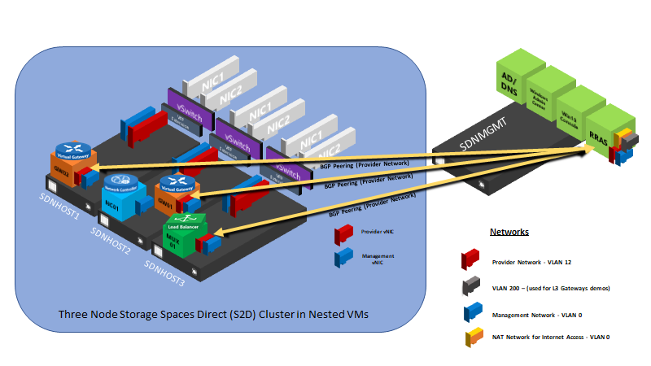

# SDN Sandbox 

SDN Sandbox is a series of scripts that creates a [HyperConverged](https://docs.microsoft.com/en-us/windows-server/hyperconverged/) environment using four nested Hyper-V Virtual Machines. The purpose of the SDN Sandbox is to provide operational training on Microsoft SDN as well as provide a development environment for DevOPs to assist in the creation and
validation of SDN features without the time consuming process of setting up physical servers and network routers\switches.

>**SDN Sandbox is not a production solution!** SDN Sandbox's scripts have been modified to work in a limited resource environment. Because of this, it is not fault tolerant, is not designed to be highly available, and lacks the nimble speed of a **real** Microsoft SDN deployment.

