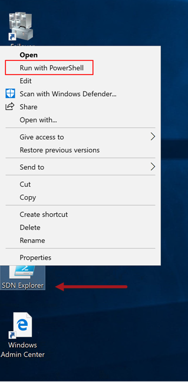

# Lab 02 : Network Controller Architecture

## Objective

In this scenario, we will be examining the SDN architecture and the different ways to access information from Network Controller.

## Exercise 01: Use SDN Explorer.

1. Log into **Console** using RDP
2. On the desktop, **Right-Click** on the **SDN Explorer** shortcut and select **Run with PowerShell**

 {:height="50%" width="50%"}

3. Next,
